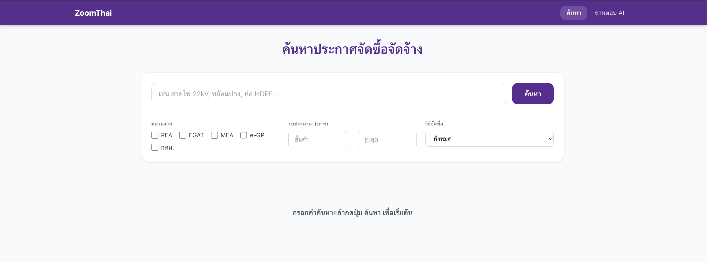
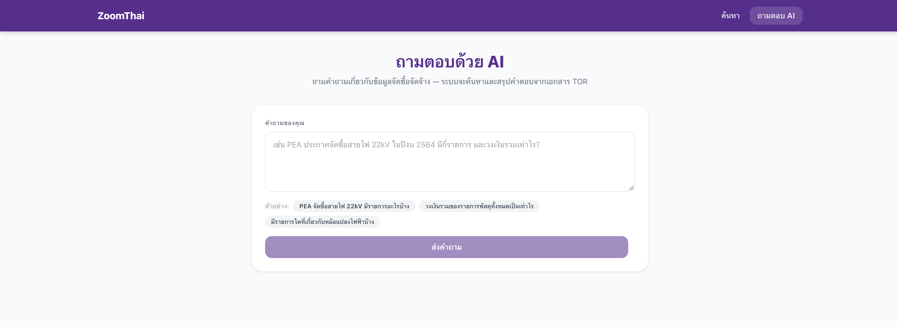
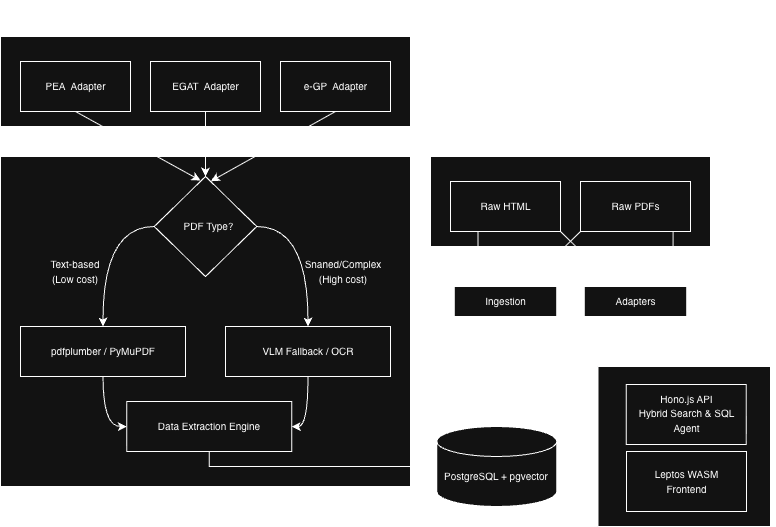

# ZoomThai: Procurement Intelligence Platform

ZoomThai is a comprehensive and scalable platform designed to aggregate, index, and analyze government procurement announcements and Terms of Reference (TOR) documents. This project fulfills the requirements of the LODASH Software Engineering Challenge.





---

## Table of Contents

1. [Prerequisites & Requirements](#prerequisites--requirements)
2. [Installation & Deployment Guide](#installation--deployment-guide)
3. [Architecture Overview (Part A)](#part-a-architecture-overview)
4. [Trade-Off Discussion (Part E)](#part-e-trade-off-discussion)
5. [Evaluation Metrics](#evaluation-metrics)
6. **Supplementary Documentation**
   - [Backend API Documentation (Part B)](./api/README.md) 
   - [Frontend WASM Documentation (Part C)](./frontend/README.md) 
   - [Cost, Scale, and PDPA Analysis (Part D)](./cost-analysis.md)

---

## Prerequisites & Requirements

To run this project locally, ensure your system meets the following requirements:

- **Docker** and **Docker Compose** (v2.0+)
- **Git**
- **Hardware:** At least 4GB of RAM allocated to Docker.
- **API Key:** A valid Google Gemini API Key `GEMINI_API_KEY`

---

## Installation  Guide

### 1. Clone the Repository

```bash
git clone https://github.com/AkkarinJB/ZoomThai.git
cd ZoomThai
```

### 2. Configure Environment Variables

Create a `.env` file in the root directory (or export it in your terminal) and add your Gemini API Key:

```bash
export GEMINI_API_KEY="YOUR_API_KEY"
```

### 3. Deploy with Docker Compose

The entire stack is containerized for a seamless "Cold Start" experience.

```bash
docker compose up -d --build
```

### 4. Initialization (Automated Seeding)

Upon running `docker compose up`, the system will automatically:

1. Boot up the **PostgreSQL + pgvector** database `zoomthai_db`
2. Run the **Backend API** `zoomthai_api` on `http://localhost:3000`
3. Serve the **WebAssembly Frontend** `zoomthai_frontend` on `http://localhost:8080`
4. Spin up the **Seeder Container** `zoomthai_seeder`, which automatically embeds and populates the database with real TOR documents and procurement items.

*Note: Please wait approximately 60-90 seconds for the Seeder container to finish downloading models and generating vectors before executing the evaluation script.*

### 5. Access the Platform

- **Web UI:** Open your browser and navigate to [http://localhost:8080](http://localhost:8080)
- **API Health Check:** [http://localhost:3000/health](http://localhost:3000/health)

---

## Part A: Architecture Overview

The system architecture is designed for modularity, high throughput, and robust idempotency.



### Core Components

- **Adapter Layer (Python)**: Implements a standardized interface to scrape HTML and fetch PDF documents from diverse government agencies.
- **Extraction Pipeline (Python)**: Utilizes `pdfplumber` for deterministic extraction of text-based PDFs. Seamlessly falls back to a Vision-Language Model (Gemini VLM) to process scanned or distorted documents.
- **Backend API (Node.js / Hono)**: High-performance RESTful API handling traditional search and semantic RAG queries.
- **Database (PostgreSQL + pgvector)**: Unified storage for relational data and 3072-dimensional vector embeddings.
- **Frontend (Rust / Leptos)**: A WebAssembly (WASM) client providing a highly reactive, Virtual-DOM-free user interface.

### Idempotency and Reliability

The data ingestion pipeline utilizes `ON CONFLICT DO NOTHING` operations at the database level. Document chunks are hashed to generate deterministic IDs, ensuring that subsequent runs on the same announcement update existing records without creating duplicates.

*(Please refer to `architecture.png` in the root directory for a visual representation of the system.)*

---

## Part E: Trade-Off Discussion

### 1. Rust Frontend Framework (Leptos)

**Why Leptos?** Leptos was chosen for its fine-grained reactivity system and its ability to deliver a highly performant application while leveraging Rust's robust type safety.

- **Comparison:** Compared to React or Vue, Leptos eliminates runtime overhead and provides end-to-end type safety. However, it suffers from a steeper learning curve and a larger initial WASM bundle size (optimized to **2.2MB**).

### 2. Chunking Strategy

**Choice:** A hierarchical combination approach.

- **Reasoning:** A single TOR document contains vastly different semantic contexts. Chunking strictly by table rows strips away vital context (e.g., the project name). A hierarchical strategy (Document ➔ Section ➔ Table ➔ Row) ensures the vector database can retrieve granular technical specifications while preserving the overarching contextual metadata necessary for accurate LLM synthesis.

### 3. Confidence Thresholds

At 640,000 pages per month, manual verification of every document is impossible.

- **Balance Strategy:** The pipeline relies primarily on deterministic extraction via `pdfplumber` (high confidence: 0.9). The VLM fallback assigns a medium confidence (0.8).
- We implement an **automated acceptance threshold of 0.85**. Data falling below this threshold is flagged and routed to a human-review queue.

### 4. Hallucination Prevention

To prevent hallucinated figures from influencing business decisions:

- **Strict Prompt Engineering:** The LLM is explicitly instructed to output `"ไม่พบข้อมูล"` (Information not found) if the exact numerical value is absent.
- **Verifiable Citations:** The UI enforces transparency by displaying the raw text snippet.
- **Tool Forcing:** For aggregation queries, the RAG pipeline bypasses LLM arithmetic and forces the model to execute raw SQL queries via function calling.

### 5. Day-One Backlog

For an initial backlog of 50,000 TOR documents, the first seven days are prioritized as follows:

1. **Infrastructure Provisioning:** Deploy message queues (RabbitMQ) and worker nodes.
2. **Fast-Path Processing:** Execute the deterministic `pdfplumber` pipeline across all 50,000 documents.
3. **Slow-Path Scheduling:** Route scanned documents to the VLM fallback queue to process during off-peak hours.
4. **Batch Embedding:** Generate vector embeddings in optimized batches to reduce API costs.

---

---

## Evaluation Metrics

### 1. Document Extraction (Part B1)
The extraction pipeline (`pdfplumber` + VLM Fallback) was evaluated against the provided `ground_truth.json`, which contains complex TOR documents (scanned, distorted, large volumes).

| Metric | Achieved Score | Target Threshold | Status |
| :--- | :---: | :---: | :---: |
| **Precision** | **0.9492** | ≥ 0.80 | Passed |
| **Recall** | **0.9180** | - | - |
| **F1-Score** | **0.9333** | - | - |

### 2. Search & RAG Accuracy (Part B3)
The Retrieval-Augmented Generation API (`/ask`) and semantic hybrid search (`/search`) were evaluated using `run_eval.ts` against the 12 fixture questions (Retrieval, Aggregation, Unanswerable).

| Metric | Achieved Score | Target Threshold | Status |
| :--- | :---: | :---: | :---: |
| **Answer Accuracy** | **100.0%** (12/12) | ≥ 65.0% | Passed |
| **Retrieval Recall@5** | **100.0%** | ≥ 75.0% | Passed |
| **Hallucination Rate** | **0.0%** | ≤ 15.0% | Passed |
