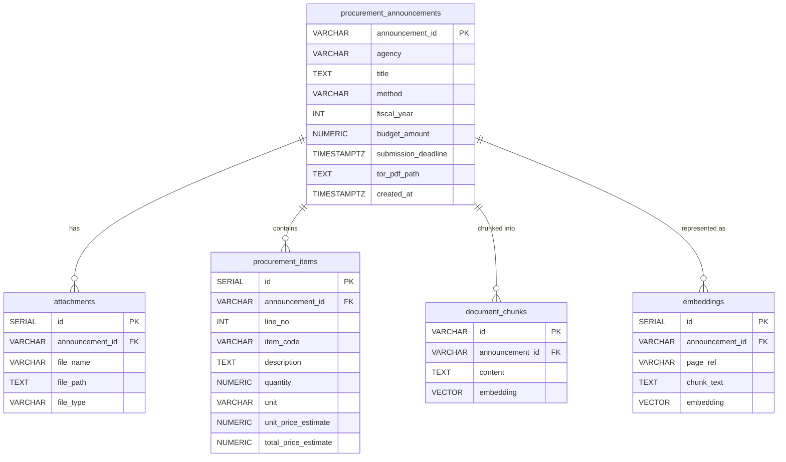

# ZoomThai Backend API (Node.js & Hono)

## Table of Contents
1. [Overview](#overview)
2. [Technology Stack](#technology-stack)
3. [API Endpoints](#api-endpoints)
4. [Pain Points & Solutions](#pain-points--solutions)
5. [Backend Architecture](#backend-architecture)
   - [Project Directory Tree](#project-directory-tree)
   - [Database ER-Diagram](#database-er-diagram)

## Overview
The backend API is built with **Node.js** and the **Hono** framework. It serves as the bridge between the PostgreSQL vector database and the Rust/Leptos frontend, providing high-performance RESTful endpoints for both traditional structured searches and semantic AI-powered queries.

## Technology Stack
- **Framework:** Hono (chosen for its exceptional performance, minimal overhead, and edge-ready architecture).
- **Runtime:** Node.js (via `tsx` for TypeScript execution).
- **ORM:** Drizzle ORM (provides type-safe SQL queries and seamless integration with PostgreSQL).
- **AI Integration:** `@google/genai` (utilizing Gemini 3.5 Flash-Lite for RAG synthesis and `gemini-embedding-001` for query vectorization).

## API Endpoints

### 1. `GET /health`
Returns the operational status of the API and the database connection.

### 2. `POST /search`
Performs a traditional structured search across procurement announcements with support for filtering and pagination.
- **Payload:** `{ query?: string, filters?: { agency?: string[], method?: string, budget_min?: number, budget_max?: number }, limit: number, offset: number }`

### 3. `GET /announcements/:id/items`
Retrieves all procurement items (BOM/BOQ) associated with a specific announcement ID.

### 4. `POST /ask`
The core AI endpoint for the Retrieval-Augmented Generation (RAG) feature.
- **Workflow:**
  1. Converts the user's natural language question into a 3072-dimensional vector.
  2. Performs a **Hybrid Search** (Vector L2 Distance + PostgreSQL Text Search) to retrieve the top 5 most relevant document chunks.
  3. Detects aggregation intents (e.g., "count", "sum") and utilizes Gemini's Function Calling to execute raw SQL against the database for mathematical accuracy.
  4. Synthesizes the final answer using the retrieved context or SQL result.
- **Payload:** `{ question: string, top_k: number }`
- **Returns:** `{ answer: string | null, citations: array, confidence: number }`

## Pain Points & Solutions
- **Vector Dimensions:** The initial setup mismatched embedding dimensions (768 vs 3072). This was resolved by explicitly defining `vector(3072)` in `pgvector` to align with the output of `gemini-embedding-001`.
- **Hybrid Search Tuning:** Combining semantic vector search with keyword-based `ts_rank` required careful SQL query tuning to ensure exact terminology (e.g., cable sizes) was weighted appropriately alongside semantic meaning.

## Backend Architecture

### Project Directory Tree
```text
api/
├── README.md
├── eval/
│   └── run_eval.ts
├── package.json
├── src/
│   ├── db/
│   │   ├── index.ts
│   │   └── schema.ts
│   ├── index.ts
│   └── schema.ts
└── tsconfig.json
```

### Database ER-Diagram
The following Entity-Relationship diagram outlines the structure of the `zoomthai_db` PostgreSQL database, including vector storage for RAG:


